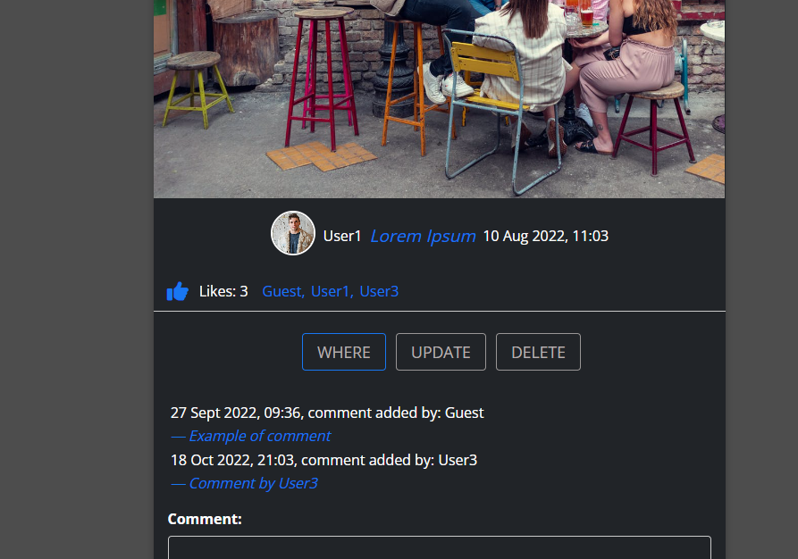

<!-- PROJECT LOGO -->
 

  

    'eventsbook' is a full stack app - this repository contains its frontend source code while
    the backend source code is stored in 
    <a href="https://github.com/spatulatom/backend-eventsbook">
    another GitHub repository  here »</a>
     
     
    <a href="https://eventsbook-91260.web.app/allevents"><strong>View the deployed app »</strong></a>
     
     
   
  

<!-- TABLE OF CONTENTS -->

  
Table of Contents

  <ol>
    <li><a href="#about-the-project">About The Project</a></li>
    <li><a href="#built-with">Built With</a></li>
    <li><a href="#acknowledgments">Acknowledgments</a></li>
  </ol>

<!-- ABOUT THE PROJECT -->

## About The Project

1. This app is a social media platform where users can:

- log in/create an account,
- upload photos/create posts (about upcoming social events),
- add likes,
- add comments,
- tag their event's location on the Google map ,
- change their passwords.

2. There are currently a few dummy users accounts created and all of them users have already posted some events as seen below:

3. Below we have an example of an event created by User1

- titled 'Lorem Ipsum'
- with the date and time of the creation
- it received 3 likes by Guest, User1 and User3
- by using the three buttons the event can be seen on Google Maps,
  Updated or Deleted
- there were two comments made by Guest and User3

(<a href="#readme-top">back to top</a>)

### Built With

- HTML, CSS,
- [![React][react.js]][react-url],
- Node.js, Express.js, Mongoose,
- MongoBD for a database,
- Firebase for deploying the frontend,
- Heroku for deploying the backend,
- Cloudinary for storing photos,
- Google Maps Platform API for events locations,
- SendGrid API for password change,
- Multer middleware library for uploading photos,
- bcrypt library for hashing passwords,
- jsonwebtoken for creating login token,
- Chrome Developer Tools for testing screen sizes and using Lighthouse,
- Chrome, Firefox, Brave Browser, Edge and Opera for browser testing the responsiveness,
- https://ui.dev/amiresponsive for testing and to make responsive image,
- https://favicon.io/favicon-generator/ to create a favicon,
- https://fontawesome.com/ for icons,
- https://tinypng.com/ to optimize images,
- https://www.remove.bg/ for removing images backgrounds,
- https://chrome.google.com/webstore/detail/pesticide-for-chrome-with/neonnmencpneifkhlmhmfhfiklgjmloi during development,
- https://wave.webaim.org/ to check web accessibility,
- https://balsamiq.com/ for wireframing.

Heavy usage of React Hooks like useReducer for managing complex state and useContext (as a part of the Context API that is being used for a "global" state managment) also useEffect, useRef, useCallback and useState. There are also custom hooks built and that is form-hook.js for managing form data, http-hook.js for all fetching requests and auth-hook.js for managing back end login token through the rerender cycles.
All sorts of errors that are being handled on the backend  (like an incorrect password) are sent to the frontend and are displayed in a modal window on UI for better UX.
As for the CSS styling, Block/Element/Modifier convention is being followed.

(<a href="#readme-top">back to top</a>)

<!-- ACKNOWLEDGMENTS -->

## Acknowledgments

- this project was completed at the end of the Udemy course <a href="https://www.udemy.com/course/react-nodejs-express-mongodb-the-mern-fullstack-guide/learn/lecture/16833284?start=15#overview">The MERN Guide</a>

- all users' accounts and all events have been created with the usage of free-to-use photos from www.pexels.com

(<a href="#readme-top">back to top</a>)

<!-- MARKDOWN LINKS & IMAGES -->

[linkedin-shield]: https://img.shields.io/badge/-LinkedIn-black.svg?style=for-the-badge&logo=linkedin&colorB=555
[linkedin-url]: https://www.linkedin.com/in/tomasz-s-069249244/
[product-screenshot]: images/screenshot.png
[next.js]: https://img.shields.io/badge/next.js-000000?style=for-the-badge&logo=nextdotjs&logoColor=white
[next-url]: https://nextjs.org/
[react.js]: https://img.shields.io/badge/React-20232A?style=for-the-badge&logo=react&logoColor=61DAFB
[react-url]: https://reactjs.org/
[vue.js]: https://img.shields.io/badge/Vue.js-35495E?style=for-the-badge&logo=vuedotjs&logoColor=4FC08D
[vue-url]: https://vuejs.org/
[angular.io]: https://img.shields.io/badge/Angular-DD0031?style=for-the-badge&logo=angular&logoColor=white
[angular-url]: https://angular.io/
[svelte.dev]: https://img.shields.io/badge/Svelte-4A4A55?style=for-the-badge&logo=svelte&logoColor=FF3E00
[svelte-url]: https://svelte.dev/
[laravel.com]: https://img.shields.io/badge/Laravel-FF2D20?style=for-the-badge&logo=laravel&logoColor=white
[laravel-url]: https://laravel.com
[bootstrap.com]: https://img.shields.io/badge/Bootstrap-563D7C?style=for-the-badge&logo=bootstrap&logoColor=white
[bootstrap-url]: https://getbootstrap.com
[jquery.com]: https://img.shields.io/badge/jQuery-0769AD?style=for-the-badge&logo=jquery&logoColor=white
[jquery-url]: https://jquery.com
